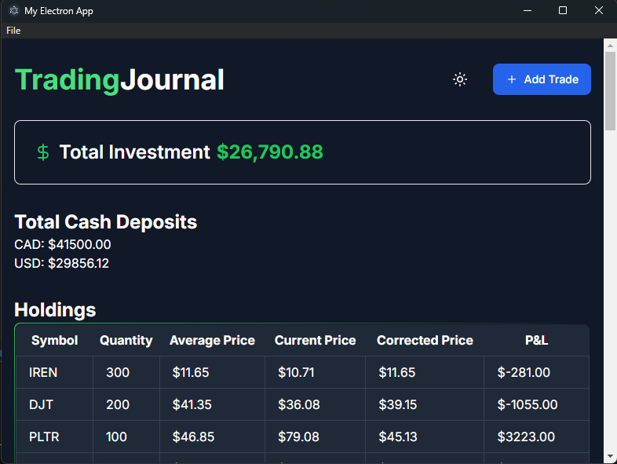

# Electron Desktop App

## Purpose

This Electron application is designed to load a specified website URL in a full-view iframe. The URL and the title can be configured in the `config.json` file, allowing users to easily change the website being displayed.

>>Example of REACT app loaded into the app by providing the URL in the config.json


## Features

- Loads a website URL in a full-view iframe.
- Provides an "About" menu with a description of the app.
- Displays an error message if the website cannot be loaded, with a link to open the site manually in a browser.

## How to Use

### Prerequisites

- Node.js and npm installed on your machine.
- Electron installed as a dependency.

### Installation

1. Clone the repository:
    ```sh
    git clone https://github.com/your-username/my-electron-app.git
    cd my-electron-app
    ```

2. Install the dependencies:
    ```sh
    npm install
    ```

### Configuration

1. Open the [config.json](http://_vscodecontentref_/0) file.
2. Update the `websiteUrl` field with the desired website URL:
    ```json
    {
        "websiteUrl": "http://your-website-url.com"
    }
    ```

### Running the App

1. Start the Electron application:
    ```sh
    npm run start
    ```

### Distribution

To package the Electron app for distribution, you can use `electron-packager` or `electron-builder`. Below are the steps for using `electron-packager`:

1. Install `electron-packager`:
    ```sh
    npm install -g electron-packager
    ```

2. Package the app:
    ```sh
    electron-packager . my-electron-app --platform=win32 --arch=x64 --out=dist --overwrite
    ```

    This command packages the app for Windows 64-bit. You can adjust the `--platform` and `--arch` options for other operating systems and architectures.

3. The packaged app will be available in the `dist` directory.

## License

This project is licensed under the ISC License.